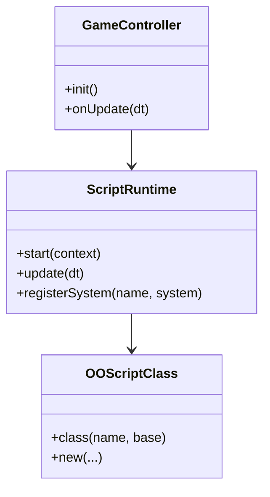

# UML Overview

```mermaid
classDiagram
    class ScriptRuntime {
      +start(context)
      +update(dt)
      +registerSystem(name, system)
    }

    class OOScriptClass {
      +class(name, base)
      +new(...)
    }

    class GameController {
      +init()
      +onUpdate(dt)
    }

    ScriptRuntime --> OOScriptClass
    GameController --> ScriptRuntime
```

This diagram shows the intended relationship between the Lua class helper,
script runtime, and gameplay-level script objects.
